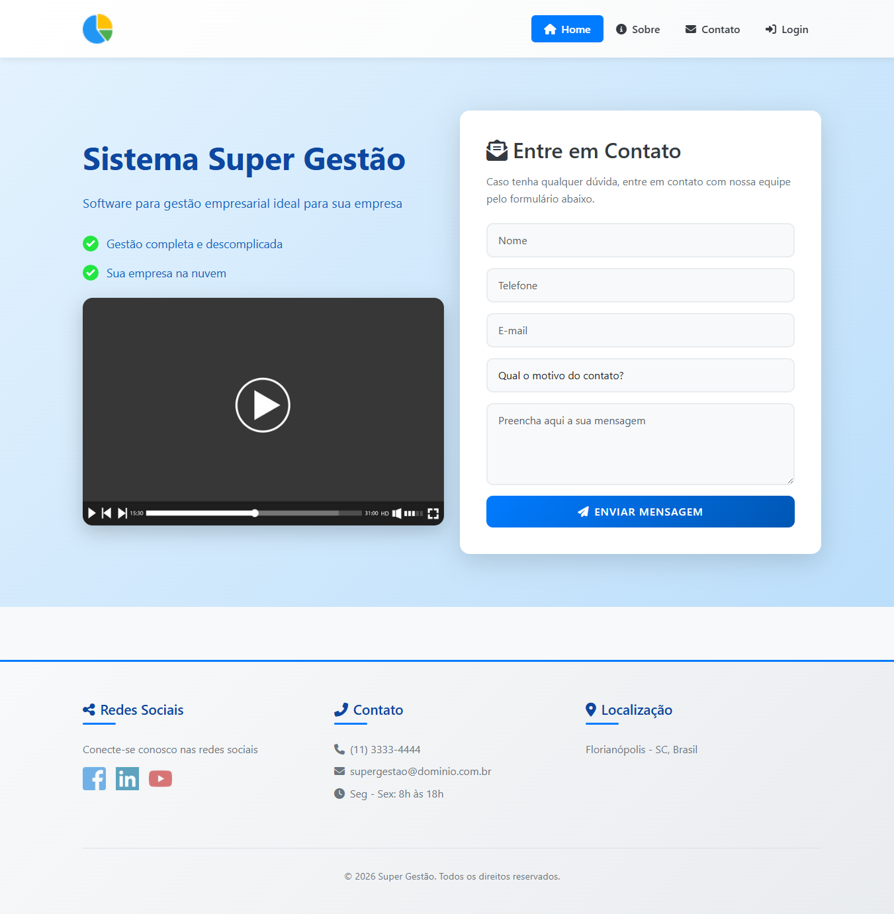

# 📊 App Super Gestão

> Sistema completo de gestão empresarial desenvolvido com Laravel 9 para gerenciamento de fornecedores, produtos, clientes e contatos.



[](https://laravel.com)
[](https://www.php.net)
[](https://opensource.org/licenses/MIT)

## 📑 Índice

- [Sobre o Projeto](#-sobre-o-projeto)
- [Funcionalidades](#-funcionalidades)
- [Requisitos](#-requisitos)
- [Instalação](#-instalação)
- [Como Usar](#-como-usar)
- [Estrutura do Projeto](#-estrutura-do-projeto)
- [Tecnologias](#-tecnologias)
- [Comandos Úteis](#-comandos-úteis)
- [Solução de Problemas](#-solução-de-problemas)
- [Licença](#-licença)

## 📖 Sobre o Projeto

O **App Super Gestão** é um sistema completo de gestão empresarial que oferece controle total sobre:

- 🏢 **Fornecedores** - Cadastro e gerenciamento completo
- 📦 **Produtos** - Controle de estoque e precificação
- 🏪 **Filiais** - Gerenciamento de múltiplas filiais
- 💰 **Produtos por Filial** - Controle de preços e estoques diferenciados por filial
- 👥 **Clientes** - Base de dados de clientes
- 📞 **Contatos** - Formulário de contato no site público
- 📧 **Gestão de Mensagens** - Painel administrativo para gerenciar contatos recebidos
- 📊 **Dashboard** - Visão geral e estatísticas em tempo real

## ✨ Funcionalidades

### 🔐 Sistema de Autenticação
- ✅ Login seguro com validação
- ✅ Logout
- ✅ Função "Lembrar-me"
- ✅ Proteção de rotas com middleware
- ✅ Mensagens de erro personalizadas

### 📊 Dashboard Administrativo
- ✅ Estatísticas em tempo real
- ✅ Contadores de fornecedores, produtos e clientes
- ✅ Interface responsiva com menu lateral
- ✅ Sistema de notificações (sucesso/erro)
- ✅ Cards coloridos e informativos

### 🏢 CRUD de Fornecedores
- ✅ Listagem com paginação automática
- ✅ Cadastro com validação (nome, site, UF, email)
- ✅ Edição de dados existentes
- ✅ Exclusão com confirmação
- ✅ Validação de email único

### 📦 CRUD de Produtos
- ✅ Listagem paginada e organizada
- ✅ Cadastro completo (nome, descrição, peso, preço)
- ✅ Controle de estoque (mínimo e máximo)
- ✅ Edição de informações
- ✅ Exclusão protegida
- ✅ Validação de valores numéricos

### 👥 CRUD de Clientes
- ✅ Listagem com dados completos
- ✅ Cadastro com validação de CPF e email
- ✅ Endereço completo (rua, cidade, UF, CEP)
- ✅ Validação de unicidade (CPF e email)
- ✅ Edição de cadastros
- ✅ Exclusão segura

### 🏪 CRUD de Filiais
- ✅ Listagem de todas as filiais
- ✅ Cadastro completo de filiais
- ✅ Edição de informações das filiais
- ✅ Exclusão protegida
- ✅ Visualização de produtos por filial

### 💰 Gestão de Produtos por Filial
- ✅ Controle de preços diferenciados por filial
- ✅ Gestão de estoque individualizado
- ✅ Listagem de produtos com suas respectivas filiais
- ✅ CRUD completo de produtos-filiais

### 📞 Formulário de Contato (Site Público)
- ✅ Validação de todos os campos
- ✅ Motivos predefinidos (Dúvida, Elogio, Reclamação)
- ✅ Salvamento no banco de dados
- ✅ Mensagens de feedback

### 📧 Gestão de Mensagens de Contato (Área Administrativa)
- ✅ Listagem completa de todas as mensagens recebidas
- ✅ Sistema de status (Novo, Lido, Respondido)
- ✅ Marcação automática como "lido" ao visualizar
- ✅ Visualização detalhada de cada mensagem
- ✅ Contador de mensagens novas no menu lateral
- ✅ Exclusão individual com confirmação SweetAlert2
- ✅ Exclusão múltipla (seleção em lote)
- ✅ Filtros por status e data
- ✅ Estatísticas de mensagens
- ✅ Links rápidos (WhatsApp, E-mail, Telefone)
- ✅ Copiar dados de contato
- ✅ Responder diretamente por e-mail

### 🚀 Funcionalidades Futuras
- ⏳ Sistema de permissões e roles
- ⏳ Relatórios e gráficos avançados
- ⏳ Exportação de dados (PDF, Excel)
- ⏳ API RESTful
- ⏳ Dashboard com gráficos dinâmicos
- ⏳ Sistema de notificações em tempo real

## 📋 Requisitos

Certifique-se de ter instalado:

| Software | Versão Mínima | Recomendado |
|----------|---------------|-------------|
| PHP | 8.0.2 | 8.2+ |
| Composer | 2.0 | Última versão |
| MySQL/MariaDB | 5.7/10.3 | 8.0/10.6 |
| Node.js | 14.x | 18.x LTS |
| NPM | 6.x | 9.x |

## 🚀 Instalação

### Passo 1: Clone o Repositório

```bash
git clone https://github.com/seu-usuario/app_super_gestao.git
cd app_super_gestao
```

### Passo 2: Instale as Dependências

```bash
# Dependências PHP
composer install

# Se houver erro de compatibilidade
composer update

# Dependências Node.js
npm install
```

### Passo 3: Configure o Ambiente

```bash
# Windows (PowerShell)
copy .env.example .env

# Linux/Mac
cp .env.example .env
```

Edite o arquivo `.env` e configure:

```env
APP_NAME="App Super Gestão"
APP_URL=http://localhost:8000

DB_CONNECTION=mysql
DB_HOST=127.0.0.1
DB_PORT=3306
DB_DATABASE=app_super_gestao
DB_USERNAME=root
DB_PASSWORD=sua_senha
```

### Passo 4: Gere a Chave da Aplicação

```bash
php artisan key:generate
```

### Passo 5: Configure o Banco de Dados

```bash
# MySQL
mysql -u root -p -e "CREATE DATABASE app_super_gestao CHARACTER SET utf8mb4 COLLATE utf8mb4_unicode_ci;"
```

### Passo 6: Execute as Migrations

```bash
# Executar todas as migrations
php artisan migrate

# Popular com dados de teste
php artisan db:seed

# Criar usuário administrador
php artisan db:seed --class=AdminUserSeeder
```

### Passo 7: Compile os Assets

```bash
# Desenvolvimento
npm run dev

# Produção
npm run prod
```

### Passo 8: Inicie o Servidor

```bash
php artisan serve
```

✅ **Pronto!** Acesse: `http://localhost:8000`

---

## 💻 Como Usar

### 🔑 Credenciais de Acesso

| Campo | Valor |
|-------|-------|
| **E-mail** | admin@supergestao.com.br |
| **Senha** | 123456 |

### 🌐 Páginas Disponíveis

#### Área Pública

| Página | URL | Descrição |
|--------|-----|-----------|
| 🏠 Home | `/` | Página inicial |
| ℹ️ Sobre | `/sobre` | Sobre a empresa |
| 📞 Contato | `/contato` | Formulário de contato |
| 🔐 Login | `/login` | Acesso ao sistema |

#### Área Administrativa (Requer Login)

| Módulo | URL | Funcionalidades |
|--------|-----|-----------------|
| 📊 Dashboard | `/app/home` | Estatísticas gerais |
| 🏢 Fornecedores | `/app/fornecedores` | CRUD completo |
| 📦 Produtos | `/app/produtos` | Gerenciar produtos |
| 🏪 Filiais | `/app/filiais` | CRUD de filiais |
| 💰 Produtos-Filiais | `/app/produtos-filiais` | Preços e estoques por filial |
| 👥 Clientes | `/app/clientes` | Base de clientes |
| 📧 Mensagens | `/app/contatos` | Gerenciar contatos recebidos |

### 🗄️ Verificar Dados no Banco

```bash
php artisan tinker

# Ver todos os fornecedores
App\Models\Fornecedor::all();

# Contar produtos
App\Models\Produto::count();

# Ver últimos 5 clientes
App\Models\Cliente::latest()->take(5)->get();
```

---

## 📁 Estrutura do Projeto

```
app_super_gestao/
├── app/
│   ├── Http/Controllers/
│   │   ├── AppController.php
│   │   ├── ClienteController.php
│   │   ├── ContatoController.php (formulário público)
│   │   ├── ContatoAdminController.php (gestão administrativa)
│   │   ├── FilialController.php
│   │   ├── FornecedorController.php
│   │   ├── LoginController.php
│   │   ├── PrincipalController.php
│   │   ├── ProdutoController.php
│   │   ├── ProdutoFilialController.php
│   │   └── SobreController.php
│   └── Models/
│       ├── Cliente.php
│       ├── Filial.php
│       ├── Fornecedor.php
│       ├── Produto.php
│       ├── ProdutoFilial.php
│       ├── SiteContato.php
│       └── User.php
├── database/
│   ├── migrations/
│   └── seeders/
├── resources/views/
│   ├── app/
│   │   ├── contato/
│   │   │   ├── index.blade.php (listagem de mensagens)
│   │   │   └── show.blade.php (detalhes da mensagem)
│   │   └── 404.blade.php (Página de erro 404 para área logada)
│   └── site/
│       └── 404.blade.php (Página de erro 404 pública)
└── routes/web.php
```

---

## 🛠️ Tecnologias

- **Laravel 9.x** - Framework PHP
- **MySQL** - Banco de dados
- **Blade** - Template engine
- **Eloquent ORM** - Mapeamento objeto-relacional
- **Laravel Mix** - Compilação de assets

---

## ⚙️ Comandos Úteis

```bash
# Limpar caches
php artisan cache:clear
php artisan config:clear
php artisan route:clear

# Gerar arquivos
php artisan make:controller NomeController
php artisan make:model NomeModel
php artisan make:migration criar_tabela

# Banco de dados
php artisan migrate
php artisan db:seed
php artisan tinker

# Ver rotas
php artisan route:list
```

---

---

## 🎨 Recursos Adicionais

### Página 404 Personalizada
O sistema possui uma página de erro 404 customizada e estilizada que é exibida quando o usuário tenta acessar uma rota inexistente:

- 🎨 Design moderno com animações
- 🔙 Botão de retorno para a página inicial
- 📞 Link direto para página de contato
- 📱 Totalmente responsiva

A página 404 é gerenciada pela rota `fallback` no arquivo `routes/web.php`.

---

## 🔧 Solução de Problemas

### Erro: composer.lock incompatível

```bash
composer update
```

### Erro de permissão no storage

Linux/Mac:
```bash
sudo chmod -R 775 storage bootstrap/cache
```

Windows: Conceda permissões de escrita nas pastas `storage` e `bootstrap/cache`

### Erro de conexão com banco

- Verifique se MySQL está rodando
- Confirme credenciais no `.env`
- Certifique-se que o banco foi criado

---

## 📄 Licença

Este projeto está licenciado sob a [MIT License](https://opensource.org/licenses/MIT).

---

<div align="center">

**Made with ❤️ using Laravel**

[⬆ Voltar ao topo](#-app-super-gestão)

</div>
